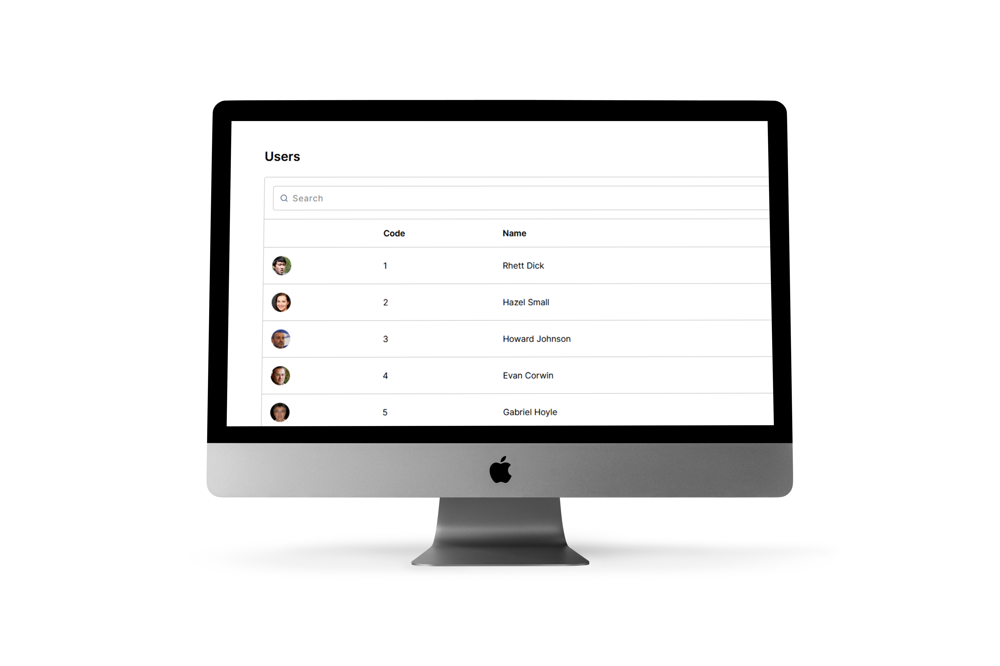

# User Management

<div align="center">

[](https://github.com/gabrielmdr/user-management-react/stargazers/ "Stars")
[](https://github.com/gabrielmdr/user-management-react/network/members "Forks")
[](https://github.com/gabrielmdr/user-management-react/watchers/ "Watchers")

</div>



## 💻 Project

This is a client user management application that consumes the API REST built in [this repository](https://github.com/gabrielmdr/user-management-spring). This application uses all methods specified in the API REST.

## 🧪 Technologies

This project was developed using the following technologies:
- React
- Typescript

## ▶ How to run

Clone the repository and access its folder:
```
$ git clone https://github.com/gabrielmdr/user-management-react
$ cd user-management-react
```

Then run the following command:
```
$ yarn start
```

## 📝 License

This project is under the MIT license. Check [LICENSE](LICENSE).